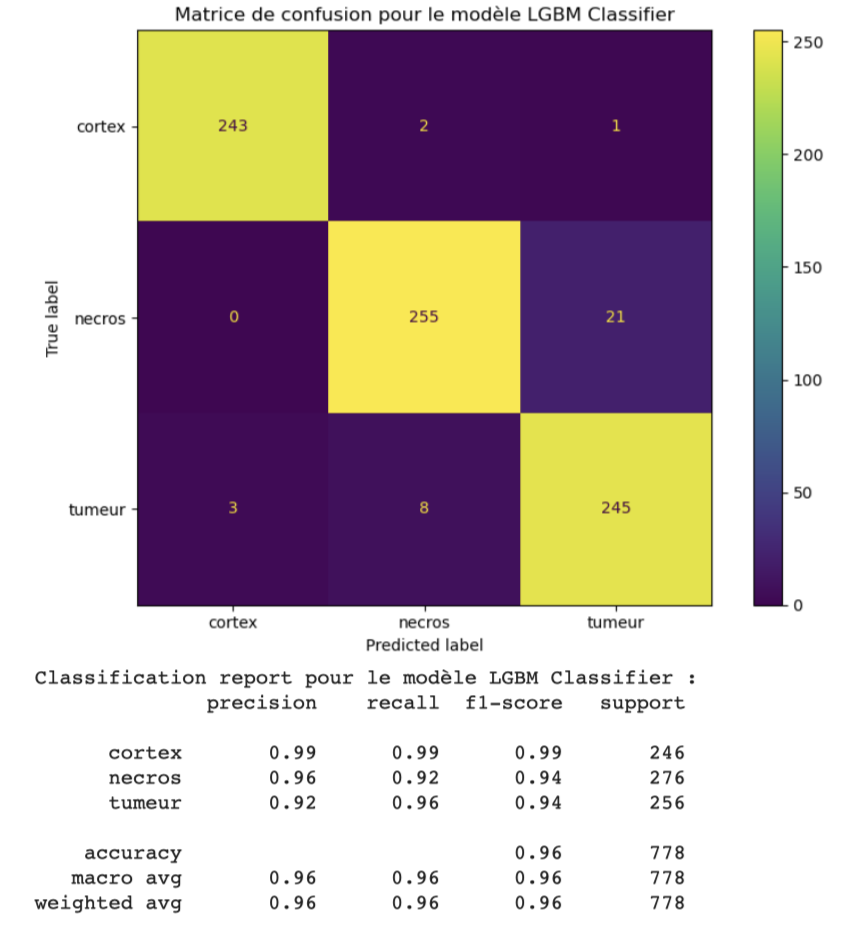
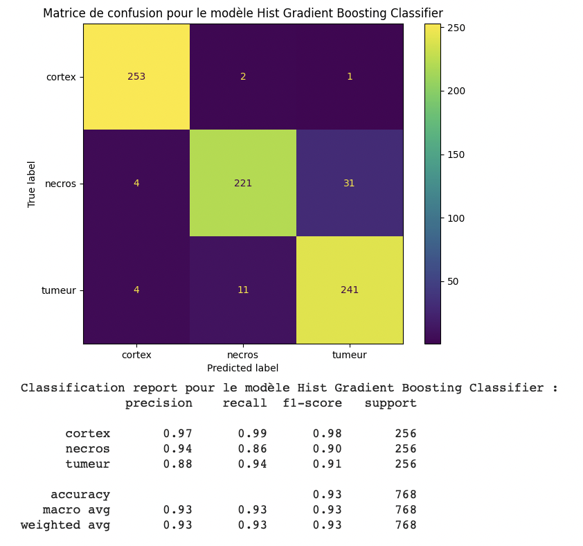
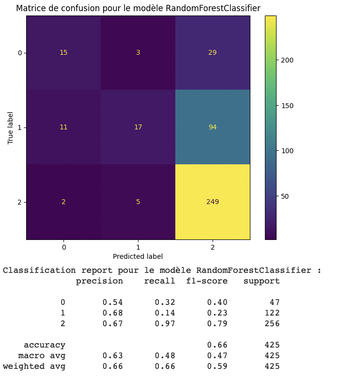

# SpiderMass ML Project  
End-to-End Mass Spectrometry Classification Pipeline with Real-Time Inference

---

## Project Overview

This project implements a complete machine learning pipeline for the analysis and classification of mass spectrometry data acquired using SpiderMass technology.

The objective is to automatically classify biological tissue samples (cortex, necrosis, tumor) based on high-dimensional spectral features.

The project includes:

- RAW → mzML conversion
- Spectral peak extraction
- Data preprocessing and normalization
- Feature engineering and dimensionality reduction (TruncatedSVD)
- Model training and evaluation
- Model serialization
- Real-time classification system
- Interactive Shiny interface (R + Python)

Due to confidentiality agreements, the original biomedical dataset is not included in this repository.

---

---

## Machine Learning Pipeline

Each trained model is stored as a full scikit-learn pipeline including:

- Missing value imputation
- Feature scaling
- TruncatedSVD dimensionality reduction
- Classification model

This guarantees consistency between training and real-time inference.

Class imbalance was handled using SMOTE and ADASYN when required.

---

## Best Performing Models

Three models achieved strong performance:

- LightGBM Classifier
- HistGradientBoostingClassifier
- RandomForestClassifier

---

# LightGBM Classifier (Best Overall Performance)

Accuracy: **96%**

- Excellent precision and recall across all classes
- Strong generalization
- Best overall balance

---

# HistGradientBoostingClassifier

Accuracy: **93%**

- Very strong performance on cortex
- Good tumor detection
- Slightly lower necrosis recall

---

# RandomForestClassifier

Accuracy: **66%**

- Strong tumor detection
- Weaker performance on minority classes
- Sensitive to class imbalance

---

## Real-Time Classification System

The project includes a real-time file monitoring system:

- Watches a directory for new RAW files
- Converts RAW → mzML
- Extracts spectral peaks
- Applies preprocessing
- Loads trained pipelines
- Outputs predicted class

The numeric feature structure used during training is preserved in:

This guarantees feature alignment during inference.

---

---

## R Shiny Interface

The project includes an interactive R Shiny application that serves as the user interface of the system.

The application allows:

- RAW to mzML file conversion  
- Spectrometry data loading  
- Data preprocessing and normalization  
- Machine learning model training and evaluation  
- Visualization of confusion matrices and performance metrics  
- Real-time classification monitoring  

The Shiny interface communicates directly with the Python backend using the `reticulate` package, enabling seamless integration between R and Python components.

Below is a screenshot of the application interface:

  

---

## Technologies Used

Python:
- scikit-learn
- LightGBM
- pyOpenMS
- imbalanced-learn
- joblib
- plotly

R:
- shiny
- reticulate
- ggplot2
- DT

---

## Key Highlights

- High-dimensional mass spectrometry classification
- Dimensionality reduction with TruncatedSVD
- Class imbalance handling
- Pipeline serialization for production use
- Real-time inference architecture
- R + Python integration

---

## Author

This project was developed during my first-year Master’s internship in Artificial Intelligence for Healthcare.